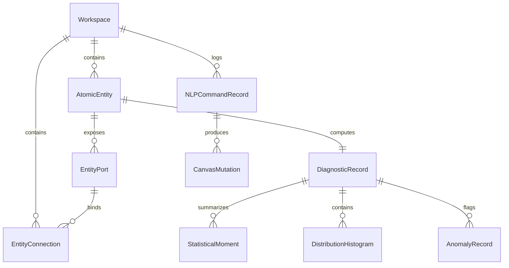

# Data Model: Financial Statistics Workspace

**Feature**: [`001-financial-statistics-workspace`](file:///home/chi/repos/Financial-Statistics-Adminiculum/specs/001-financial-statistics-workspace/spec.md)  
**Date**: 2026-09-13  
**Status**: Draft  

---

## Entity Relationship Overview

---

## Core Entities & Schemas

### 1. Workspace
The root container encapsulating an interactive canvas session, atomic entities, topological wiring, viewport coordinates, and audit history.

| Field | Type | Description | Validation / Constraints |
| :--- | :--- | :--- | :--- |
| `id` | `UUID` | Unique workspace identifier | Required, immutable, standard RFC 4122 |
| `name` | `string` | Human-readable name for the workspace | Required, 1–100 characters |
| `description` | `string?` | Optional purpose or hypothesis description | Max 500 characters |
| `viewport` | `ViewportState` | Current zoom level and pan coordinates | `zoom` $\in [0.1, 4.0]$, `x`, `y` finite numbers |
| `settings` | `WorkspaceSettings`| Global time horizon, sampling interval, theme | Required |
| `createdAt` | `DateTimeOffset` | Creation timestamp | ISO 8601 UTC |
| `updatedAt` | `DateTimeOffset` | Last modified timestamp | ISO 8601 UTC |
| `entities` | `List<AtomicEntity>` | Collection of active nodes on canvas | Zero or more |
| `connections`| `List<EntityConnection>`| Topological edges linking ports | No circular references |

#### State Transitions
- **Draft/Active**: User is adding, configuring, or wiring entities.
- **Executing**: Asynchronous tool evaluation or heavy server data sync in progress.
- **Exporting**: Generating high-fidelity PDF, PNG, or CSV outputs.

---

### 2. AtomicEntity
An autonomous computational node on the canvas possessing defined inputs, parameters, mathematical kernel, and outputs.

| Field | Type | Description | Validation / Constraints |
| :--- | :--- | :--- | :--- |
| `id` | `UUID` | Unique entity identifier on canvas | Required, unique within workspace |
| `workspaceId` | `UUID` | Parent workspace reference | Required |
| `type` | `EntityType` | Categorical entity identity | One of: `PriceStream`, `RollingWindow`, `MovingAverage`, `VolatilityEstimator`, `DistributionAnalyzer`, `CorrelationMatrix`, `SignalTrigger`, `CustomTransform` |
| `label` | `string` | Display name on the canvas card | Required, 1–60 characters |
| `position` | `{ x: float, y: float }` | Canvas 2D coordinates | Finite numbers |
| `parameters` | `Dictionary<string, object>` | Configurable algorithmic parameters | Validated against entity type schema |
| `inputPorts` | `List<EntityPort>` | Available data ingestion ports | Unique port identifiers per entity |
| `outputPorts`| `List<EntityPort>` | Emitted calculation streams | Unique port identifiers per entity |
| `status` | `EntityStatus` | Operational health of node | `Ready`, `Computing`, `Stale`, `Error`, `Warning` |
| `errorMessage`| `string?` | Descriptive issue if status is `Error` | Plain language, non-technical |
| `lastCalculatedAt` | `DateTimeOffset?` | Timestamp of latest evaluation | ISO 8601 UTC |

#### Common Entity Types & Parameter Schemas
1. **PriceStream**:
   - Parameters: `{ symbol: "AAPL", interval: "1d", lookback: 252, source: "BuiltIn" | "UserUpload" }`
   - Ports: Output `[ "prices", "timestamps", "returns" ]`
2. **RollingWindow**:
   - Parameters: `{ windowSize: 20, minPeriods: 5, windowType: "Simple" | "Exponential" }`
   - Ports: Input `[ "series" ]`, Output `[ "windowed_series" ]`
3. **MovingAverage**:
   - Parameters: `{ period: 20, method: "SMA" | "EMA" | "WMA" }`
   - Ports: Input `[ "series" ]`, Output `[ "ma_series", "residuals" ]`
4. **VolatilityEstimator**:
   - Parameters: `{ period: 30, annualizationFactor: 252, method: "StandardDeviation" | "Parkinson" | "GarmanKlass" }`
   - Ports: Input `[ "returns" | "ohlc" ]`, Output `[ "annualized_vol", "daily_vol" ]`
5. **DistributionAnalyzer**:
   - Parameters: `{ numBins: 50, confidenceLevel: 0.95 }`
   - Ports: Input `[ "series" ]`, Output `[ "moments", "quantiles", "histogram" ]`
6. **SignalTrigger**:
   - Parameters: `{ condition: "GreaterThan" | "LessThan" | "CrossesAbove", threshold: 2.0 }`
   - Ports: Input `[ "metric", "benchmark?" ]`, Output `[ "signals", "events" ]`

---

### 3. EntityPort & EntityConnection

#### EntityPort
| Field | Type | Description |
| :--- | :--- | :--- |
| `id` | `string` | Unique port key (e.g. `in_series`, `out_vol`) |
| `entityId` | `UUID` | Host entity identifier |
| `name` | `string` | Human-readable port label |
| `direction` | `PortDirection` | `Input` or `Output` |
| `dataType` | `DataType` | `TimeSeriesArray`, `ScalarMetric`, `BooleanCondition`, `Matrix` |

#### EntityConnection
| Field | Type | Description | Validation |
| :--- | :--- | :--- | :--- |
| `id` | `string` | Edge identifier | Unique within workspace |
| `sourceEntityId` | `UUID` | Upstream entity | Must exist in workspace |
| `sourcePortId` | `string` | Upstream output port | Must match `DataType` of target |
| `targetEntityId` | `UUID` | Downstream entity | Cannot equal `sourceEntityId` |
| `targetPortId` | `string` | Downstream input port | Cannot accept multiple incoming edges if single-arity |

---

### 4. DiagnosticRecord & StatisticalMoment
Captures transparent observability details, statistical breakdowns, and calculation traces.

| Field | Type | Description |
| :--- | :--- | :--- |
| `entityId` | `UUID` | Owning atomic entity |
| `observationCount` | `int` | Number of data points analyzed |
| `mean` | `decimal` | Arithmetic mean of current active window |
| `variance` | `decimal` | Unbiased sample variance ($s^2$) |
| `stdDev` | `decimal` | Standard deviation ($s = \sqrt{s^2}$) |
| `skewness` | `decimal` | Fisher-Pearson coefficient of skewness ($g_1$) |
| `kurtosis` | `decimal` | Excess kurtosis ($g_2 = m_4/m_2^2 - 3$) |
| `quantiles` | `Dictionary<string, decimal>` | Empirical quantiles (`p01`, `p05`, `p25`, `p50`, `p75`, `p95`, `p99`) |
| `histogramBins`| `List<HistogramBin>` | Binned frequencies for empirical distribution plots |
| `formulaTrace` | `string` | Formatted LaTeX / plain-text representation of exact equation executed |
| `anomalies` | `List<AnomalyEvent>` | Timestamped points exceeding configurable tolerance thresholds |

---

### 5. NLPCommandRecord & CanvasMutation
Maintains the audit log of natural language interactions, dynamic tool resolution, and undo history.

| Field | Type | Description |
| :--- | :--- | :--- |
| `id` | `UUID` | Command transaction identifier |
| `workspaceId` | `UUID` | Target workspace |
| `prompt` | `string` | Original user input text |
| `resolvedTool` | `string` | Dynamic tool name selected by model |
| `extractedParameters` | `Dictionary<string, object>` | Structured arguments parsed from prompt |
| `status` | `CommandStatus` | `Executed`, `Failed`, `Reverted` |
| `mutations` | `List<CanvasMutation>` | Atomic topological modifications applied to canvas |
| `undoSnapshot`| `WorkspaceSnapshot` | Inverse mutation payload enabling 1-click reversal |
| `createdAt` | `DateTimeOffset` | Execution timestamp |

#### CanvasMutation Operations
- `ADD_ENTITY`: `{ entity: AtomicEntity }`
- `REMOVE_ENTITY`: `{ entityId: UUID }`
- `UPDATE_PARAMETERS`: `{ entityId: UUID, previous: {...}, updated: {...} }`
- `ADD_CONNECTION`: `{ connection: EntityConnection }`
- `REMOVE_CONNECTION`: `{ connectionId: string }`

---

### 6. ExportPackage
Encapsulates requested visual and data export artifacts.

| Field | Type | Description |
| :--- | :--- | :--- |
| `exportId` | `UUID` | Identifier for tracking generation |
| `format` | `ExportFormat` | `PDF`, `PNG`, `SVG`, `CSV`, `JSON`, `MANIFEST` |
| `scope` | `ExportScope` | `FullWorkspace`, `SelectedEntities`, `SingleEntity` |
| `dpi` | `int` | Output resolution (e.g. 300 for print) |
| `content` | `byte[]` or `string` | Serialized file stream or data payload |
| `filename` | `string` | Suggested download filename with extension |
| `metadata` | `ExportMetadata` | Title, author, generation timestamp, parameter manifest |
