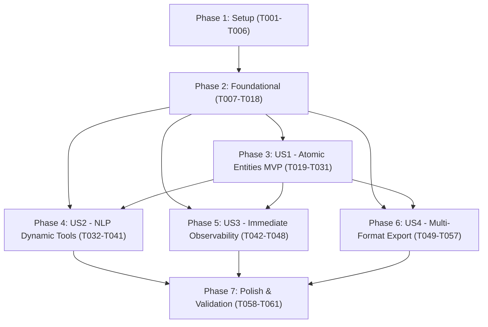

# Tasks: Financial Statistics Workspace

**Feature**: [`001-financial-statistics-workspace`](file:///home/chi/repos/Financial-Statistics-Adminiculum/specs/001-financial-statistics-workspace/spec.md)  
**Input**: Plan from [`specs/001-financial-statistics-workspace/plan.md`](file:///home/chi/repos/Financial-Statistics-Adminiculum/specs/001-financial-statistics-workspace/plan.md)  
**Constitution**: [`constitution.md (v1.0.0)`](file:///home/chi/repos/Financial-Statistics-Adminiculum/.specify/memory/constitution.md)  
**Status**: Ready for Implementation  

---

## Phase 1: Setup (Shared Infrastructure)

**Purpose**: Initialize the frontend React 18+ TypeScript application with the chosen stack (Tailwind CSS, shadcn/ui, Zod, TanStack Query, Lucide React, Zustand, Vite) and test configurations.

- [X] T001 Initialize React 18+ TypeScript project scaffold with Vite, Tailwind CSS, `@xyflow/react`, `zustand`, `lucide-react`, `zod`, `@tanstack/react-query`, `chart.js`, `react-chartjs-2`, `lightweight-charts`, `jspdf`, `jspdf-autotable`, and `html-to-image` in `FinancialStatisticsAdminiculum.Web/package.json`
- [X] T002 [P] Configure Tailwind CSS with CSS variables theme tokens (`--background`, `--foreground`, `--primary`, `--border`, `--radius`) for open visual customization in `FinancialStatisticsAdminiculum.Web/tailwind.config.js` and `FinancialStatisticsAdminiculum.Web/src/index.css`
- [X] T003 [P] Configure shadcn/ui settings (`components.json`) and scaffold base Radix UI primitives (`button.tsx`, `dialog.tsx`, `input.tsx`, `command.tsx`, `sheet.tsx`, `badge.tsx`, `slider.tsx`) in `FinancialStatisticsAdminiculum.Web/src/components/ui/`
- [X] T004 [P] Configure Vite development server and backend API reverse proxy (`/api` -> `http://localhost:5000`) in `FinancialStatisticsAdminiculum.Web/vite.config.ts`
- [X] T005 [P] Configure TypeScript compiler settings, strict null checks, and path aliases (`@/*` -> `./src/*`) in `FinancialStatisticsAdminiculum.Web/tsconfig.json`
- [X] T006 [P] Configure Vitest unit testing environment with jsdom and testing-library matchers in `FinancialStatisticsAdminiculum.Web/vitest.config.ts`

---

## Phase 2: Foundational (Blocking Prerequisites)

**Purpose**: Core domain models, persistence layers, base API endpoints, Zod schemas, and TanStack Query client that MUST be complete before ANY user story can proceed.

**⚠️ CRITICAL**: No user story work can begin until this phase is complete.

- [X] T007 [P] Implement core `Workspace` entity with validation (Id: UUID, Name: 1-100 characters, Description: max 500 characters, ViewportState: zoom in `[0.1, 4.0]`, x/y finite numbers, Timestamps) in `FinancialStatisticsAdminiculum.Core/Entities/Workspace.cs`
- [X] T008 [P] Implement core `AtomicEntity` entity with validation (Type: Enum, Label: 1-60 characters, Position: x/y finite numbers, Parameters: JSONB, Status: Enum) in `FinancialStatisticsAdminiculum.Core/Entities/AtomicEntity.cs`
- [X] T009 [P] Implement core `EntityConnection` entity (SourceEntityId: UUID, SourcePortId: string, TargetEntityId: UUID, TargetPortId: string) with transitive cycle detection in `FinancialStatisticsAdminiculum.Core/Entities/EntityConnection.cs`
- [X] T010 Configure EF Core DbContext entity configurations, relational tables, and JSONB value conversions for `Workspace`, `AtomicEntity`, and `EntityConnection` in `FinancialStatisticsAdminiculum.Infrastructure/AppDbContext.cs`
- [X] T011 Create and apply EF Core database migration for workspace entities in `FinancialStatisticsAdminiculum.Infrastructure/Migrations/`
- [X] T012 [P] Define `IWorkspaceService` and `IWorkspaceRepository` interfaces in `FinancialStatisticsAdminiculum.Application/Interfaces/IWorkspaceService.cs`
- [X] T013 Implement `WorkspaceService` handling CRUD operations, JSONB serialization, and validation in `FinancialStatisticsAdminiculum.Application/Services/WorkspaceService.cs`
- [X] T014 Implement `WorkspacesController` with endpoints (`GET /api/workspaces`, `POST /api/workspaces`, `GET /api/workspaces/{id}`, `PUT /api/workspaces/{id}`, `DELETE /api/workspaces/{id}`) per OpenAPI contract in `FinancialStatisticsAdminiculum.Api/Controllers/WorkspacesController.cs`
- [X] T015 [P] Implement `MarketDataController` serving asset listings (`GET /api/marketdata/assets`) and historical price series (`GET /api/marketdata/series`) in `FinancialStatisticsAdminiculum.Api/Controllers/MarketDataController.cs`
- [X] T016 [P] Implement Zod runtime schemas (`WorkspaceSchema`, `AtomicEntitySchema`, `EntityPortSchema`, `EntityConnectionSchema`, `WorkspaceManifestSchema`) and export inferred TypeScript types in `FinancialStatisticsAdminiculum.Web/src/schemas/workspace.ts`
- [X] T017 [P] Configure TanStack Query client, default query options, and API client wrapper (`apiClient.ts`) in `FinancialStatisticsAdminiculum.Web/src/services/apiClient.ts`
- [X] T018 [P] Implement TanStack Query hooks (`useWorkspaces`, `useWorkspace`, `useSaveWorkspace`, `useMarketAssets`, `useMarketSeries`) in `FinancialStatisticsAdminiculum.Web/src/hooks/useWorkspaces.ts`

**Checkpoint**: Foundation ready — database tables, backend APIs, Zod schemas, and TanStack Query client abstractions are established. User story implementation can begin.

---

## Phase 3: User Story 1 - Unguided First-Principles Construction via Atomic Entities (Priority: P1) 🎯 MVP

**Goal**: Enable users to freely assemble, configure, and connect atomic statistical entities on an unguided canvas with sub-200ms reactive parameter recalculation and live visual graph updates.

**Independent Test**: Launch the workspace on a clean canvas, add a `PriceStream` node and a `MovingAverage` node, connect their ports, adjust the period slider, and observe immediate deterministic recalculation without loading indicators or modal interruptions.

### Tests for User Story 1 ⚠️
> **NOTE: Write these tests FIRST, ensure they FAIL before implementation**

- [X] T019 [P] [US1] Unit test statistical calculations (SMA, EMA, Rolling Volatility, Z-Scores) for numeric precision and edge cases (zero variance, flatline series) in `FinancialStatisticsAdminiculum.Web/tests/kernel/statisticsKernel.test.ts`
- [X] T020 [P] [US1] Unit test Zustand workspace store (adding nodes, removing nodes, updating parameters, wiring ports, detecting cyclic connections) in `FinancialStatisticsAdminiculum.Web/tests/store/workspaceStore.test.ts`

### Implementation for User Story 1

- [X] T021 [P] [US1] Implement high-precision client-side statistical calculation kernel (`calculateSma`, `calculateEma`, `calculateRollingVolatility`, `calculateZScores`) using deterministic arithmetic in `FinancialStatisticsAdminiculum.Web/src/kernel/statisticsKernel.ts`
- [X] T022 [US1] Implement Zustand workspace store managing canvas nodes, edges, topological recalculation cascades (<200ms for 10,000 observations), and cycle prevention in `FinancialStatisticsAdminiculum.Web/src/store/workspaceStore.ts`
- [X] T023 [P] [US1] Implement base node card wrapper (`BaseEntityNode.tsx`) using unopinionated shadcn/ui primitives, customizable Tailwind styling, typed input/output handles, and Lucide status icons in `FinancialStatisticsAdminiculum.Web/src/components/nodes/BaseEntityNode.tsx`
- [X] T024 [P] [US1] Implement `PriceStreamNode` supporting asset selection (`AAPL`, `MSFT`, `SPY`) and lookback periods in `FinancialStatisticsAdminiculum.Web/src/components/nodes/PriceStreamNode.tsx`
- [X] T025 [P] [US1] Implement `RollingWindowNode` and `MovingAverageNode` with period slider (5–200) and method selector (SMA, EMA, WMA) in `FinancialStatisticsAdminiculum.Web/src/components/nodes/MovingAverageNode.tsx`
- [X] T026 [P] [US1] Implement `VolatilityEstimatorNode` with rolling window and annualization parameters (252 days) in `FinancialStatisticsAdminiculum.Web/src/components/nodes/VolatilityEstimatorNode.tsx`
- [X] T027 [P] [US1] Implement `DistributionAnalyzerNode` and `CorrelationMatrixNode` with configurable bin counts and confidence levels in `FinancialStatisticsAdminiculum.Web/src/components/nodes/DistributionAnalyzerNode.tsx`
- [X] T028 [P] [US1] Implement `SignalTriggerNode` with threshold slider and condition comparators (`GreaterThan`, `LessThan`, `CrossesAbove`) in `FinancialStatisticsAdminiculum.Web/src/components/nodes/SignalTriggerNode.tsx`
- [X] T029 [US1] Implement interactive React Flow canvas component with node palette, customizable grid, and navigation minimap in `FinancialStatisticsAdminiculum.Web/src/components/canvas/WorkspaceCanvas.tsx`
- [X] T030 [US1] Implement parameter inspector sidebar allowing direct fine-grained mathematical parameter editing in `FinancialStatisticsAdminiculum.Web/src/components/inspector/ParameterInspector.tsx`
- [X] T031 [US1] Assemble main unguided application layout in `FinancialStatisticsAdminiculum.Web/src/App.tsx` ensuring zero mandatory tutorial wizards or walkthrough modals appear on startup

**Checkpoint**: User Story 1 is fully functional. The unguided atomic entity workbench operates with sub-200ms reactivity (MVP achieved).

---

## Phase 4: User Story 2 - Natural Language Command Interface & Dynamic Tool Execution (Priority: P1)

**Goal**: Provide an omnipresent natural language processing (NLP) command bar that dynamically resolves analytical tools through FunctionGemma, applies canvas mutations, and provides 1-click undo, with clear offline diagnostic indicators.

**Independent Test**: Press `Cmd+K`, type "Add a 30-day volatility estimator for AAPL and wire an alert when annualized volatility > 25%", verify that the backend resolves the tool, mutates the canvas, and displays an undo badge that reverts the change on click. When offline, verify the "AI Offline" notice disables prompt submission while canvas remains operable.

### Tests for User Story 2 ⚠️
> **NOTE: Write these tests FIRST, ensure they FAIL before implementation**

- [X] T032 [P] [US2] Contract test for `POST /api/workspaces/{id}/nlp-command` per OpenAPI contract in `FinancialStatisticsAdminiculum.Api.Tests/Controllers/NlpCommandControllerTests.cs`
- [X] T033 [P] [US2] Unit test dynamic tool schema registration and FunctionGemma tool resolver in `FinancialStatisticsAdminiculum.Application.Tests/AI/DynamicToolTests.cs`
- [X] T034 [P] [US2] Unit test client-side Undo/Redo mutation transaction stack in `FinancialStatisticsAdminiculum.Web/tests/store/undoManager.test.ts`

### Implementation for User Story 2

- [X] T035 [P] [US2] Implement dynamic `VolatilityToolHandler` conforming to `IGemmaTool` with JSON schema in `FinancialStatisticsAdminiculum.Application/AI/Tools/VolatilityToolHandler.cs`
- [X] T036 [P] [US2] Implement dynamic `SignalTriggerToolHandler` conforming to `IGemmaTool` with JSON schema in `FinancialStatisticsAdminiculum.Application/AI/Tools/SignalTriggerToolHandler.cs`
- [X] T037 [US2] Implement `NlpCommandService` in `FinancialStatisticsAdminiculum.Application/AI/Services/NlpCommandService.cs` executing through `IToolResolver` and `IAiSchemaAggregator` with schema validation
- [X] T038 [US2] Implement `POST /api/workspaces/{id}/nlp-command` endpoint with timeout handling in `FinancialStatisticsAdminiculum.Api/Controllers/AiAnalysisController.cs`
- [X] T039 [US2] Implement client-side Undo/Redo transaction manager for atomic canvas mutations in `FinancialStatisticsAdminiculum.Web/src/store/undoManager.ts`
- [X] T040 [P] [US2] Implement omnipresent NLP command bar (`Cmd+K` / `Ctrl+K`) using shadcn/ui `Command` component with dynamic tool suggestions in `FinancialStatisticsAdminiculum.Web/src/components/nlp/NlpCommandBar.tsx`
- [X] T041 [US2] Implement non-blocking NLP audit trail banner with 1-click Undo button and "AI Offline" diagnostic notice per FR-008 when inference service is unreachable in `FinancialStatisticsAdminiculum.Web/src/components/nlp/NlpAuditBadge.tsx`

**Checkpoint**: User Stories 1 AND 2 are complete. Canvas can be driven manually or synthesized via natural language commands with instant undo.

---

## Phase 5: User Story 3 - Immediate Observability & Statistical Transparency (Priority: P2)

**Goal**: Render live sparklines and status badges directly on entity nodes, accompanied by an inspectable "Statistics View" displaying probability density functions (KDE), cumulative distributions, empirical quantiles, and step-by-step mathematical formula traces.

**Independent Test**: Select any computational node on the canvas, open the Statistics View inspector, and confirm real-time rendering of KDE distribution curves, moments table, anomaly markers ($\pm 2\sigma$), and parameter-substituted formulas.

### Tests for User Story 3 ⚠️
> **NOTE: Write these tests FIRST, ensure they FAIL before implementation**

- [X] T042 [P] [US3] Unit test Kernel Density Estimation (Gaussian KDE), empirical quantiles, and moments (skewness, kurtosis) in `FinancialStatisticsAdminiculum.Web/tests/kernel/distributionCalculations.test.ts`

### Implementation for User Story 3

- [X] T043 [P] [US3] Implement Gaussian KDE, CDF, empirical quantiles ($p01$–$p99$), and outlier anomaly detection ($\pm 2\sigma$, $\pm 3\sigma$) in `FinancialStatisticsAdminiculum.Web/src/kernel/distributionCalculations.ts`
- [X] T044 [P] [US3] Implement on-node live sparkline and mini-metric summary component in `FinancialStatisticsAdminiculum.Web/src/components/nodes/NodeSparkline.tsx`
- [X] T045 [P] [US3] Implement probability density (KDE) and histogram chart component using Chart.js in `FinancialStatisticsAdminiculum.Web/src/components/inspector/DistributionPlot.tsx`
- [X] T046 [P] [US3] Implement statistical moments breakdown table (Mean, Variance, StdDev, Skewness, Kurtosis, Quantiles) in `FinancialStatisticsAdminiculum.Web/src/components/inspector/MomentsTable.tsx`
- [X] T047 [P] [US3] Implement mathematical formula trace viewer showing LaTeX equations with active substituted parameter values in `FinancialStatisticsAdminiculum.Web/src/components/inspector/FormulaTraceView.tsx`
- [X] T048 [US3] Assemble the "Statistics View" slide-out inspector drawer using shadcn/ui `Sheet` in `FinancialStatisticsAdminiculum.Web/src/components/inspector/StatisticsViewDrawer.tsx`

**Checkpoint**: User Stories 1, 2, and 3 are complete. Mathematical concepts and distributions are transparently observable on demand.

---

## Phase 6: User Story 4 - Extreme Multi-Format Exportability (Priority: P3)

**Goal**: Provide instant high-resolution image exports (PNG 300 DPI, vector SVG), publication-grade multi-page PDF analytical reports, lossless tabular data downloads (CSV/JSON), CSV auto-detection with interactive preview, and portable JSON workspace manifests with PostgreSQL hybrid persistence.

**Independent Test**: Trigger an export of a multi-node workspace in PNG, PDF, CSV, and manifest formats; verify that PNG is $<1$s, PDF is $<3$s with full vector charts and formula breakdowns, CSV preserves decimal precision, and manifest can be re-imported cleanly. Upload a custom CSV to verify auto-detection and interactive preview.

### Tests for User Story 4 ⚠️
> **NOTE: Write these tests FIRST, ensure they FAIL before implementation**

- [X] T049 [P] [US4] Unit test CSV auto-detection, JSON serialization, and manifest Zod schema compliance in `FinancialStatisticsAdminiculum.Web/tests/services/exportService.test.ts`

### Implementation for User Story 4

- [X] T050 [P] [US4] Implement CSV upload parsing and auto-detection utility (delimiter, decimal separator, date format) in `FinancialStatisticsAdminiculum.Web/src/services/csvDetector.ts`
- [X] T051 [P] [US4] Implement interactive CSV upload preview dialog with manual override controls per FR-003a using shadcn/ui `Dialog` and `Table` in `FinancialStatisticsAdminiculum.Web/src/components/export/CsvUploadDialog.tsx`
- [X] T052 [P] [US4] Implement raster (PNG 300+ DPI) and vector (SVG) capture service using `html-to-image` in `FinancialStatisticsAdminiculum.Web/src/services/imageExportService.ts`
- [X] T053 [P] [US4] Implement publication-grade multi-page PDF analytical dossier generator embedding vector charts, statistical tables, and methodology notes in `FinancialStatisticsAdminiculum.Web/src/services/pdfExportService.ts`
- [X] T054 [P] [US4] Implement raw and processed time-series tabular CSV and JSON export service in `FinancialStatisticsAdminiculum.Web/src/services/dataExportService.ts`
- [X] T055 [P] [US4] Implement workspace manifest export and import validator adhering to `workspace-manifest.schema.json` via Zod in `FinancialStatisticsAdminiculum.Web/src/services/manifestService.ts`
- [X] T056 [US4] Implement export action menu and format configuration dialog using shadcn/ui `DropdownMenu` in `FinancialStatisticsAdminiculum.Web/src/components/export/ExportMenu.tsx`
- [X] T057 [US4] Implement background auto-save sync persisting workspace topology and job states to PostgreSQL via backend API per FR-021 in `FinancialStatisticsAdminiculum.Web/src/services/persistenceService.ts`

**Checkpoint**: All 4 user stories are fully implemented and independently verifiable.

---

## Phase 7: Polish & Cross-Cutting Concerns

**Purpose**: Distributed telemetry verification, container updates, edge-case hardening, and end-to-end acceptance run.

- [X] T058 [P] Add OpenTelemetry tracing instrumentation and Serilog contextual enrichment to new workspace and NLP endpoints in `FinancialStatisticsAdminiculum.Api/Program.cs`
- [X] T059 [P] Update `compose.yaml` to include the `web` frontend service with hot reloading for development in `compose.yaml`
- [X] T060 [P] Implement global React error boundary and fallback recovery for corrupted canvas topologies in `FinancialStatisticsAdminiculum.Web/src/components/common/ErrorBoundary.tsx`
- [X] T061 Run end-to-end validation scenarios per `quickstart.md` across all 4 user stories and document results in `specs/001-financial-statistics-workspace/quickstart.md`

---

## Dependencies & Execution Order



### User Story Dependencies

- **User Story 1 (P1)**: Depends ONLY on Phase 2 (Foundational). Can be delivered as standalone MVP.
- **User Story 2 (P1)**: Depends on Phase 2 and hooks into the canvas store created in US1 to apply mutations.
- **User Story 3 (P2)**: Depends on Phase 2 and reads node statistical state from US1 to populate distribution charts and formulas.
- **User Story 4 (P3)**: Depends on Phase 2 and captures rendered visual cards from US1/US3 and tabular metrics.
- **Polish (Phase 7)**: Depends on all desired user stories being complete.

---

## Parallel Execution Examples

### User Story 1 Parallel Stream
```bash
# Tests (TDD - run first):
Task T019: Unit test statistical calculations in tests/kernel/statisticsKernel.test.ts
Task T020: Unit test Zustand workspace store in tests/store/workspaceStore.test.ts

# Custom Atomic Nodes (in parallel once BaseEntityNode is drafted):
Task T024: Implement PriceStreamNode in src/components/nodes/PriceStreamNode.tsx
Task T025: Implement MovingAverageNode in src/components/nodes/MovingAverageNode.tsx
Task T026: Implement VolatilityEstimatorNode in src/components/nodes/VolatilityEstimatorNode.tsx
Task T027: Implement DistributionAnalyzerNode in src/components/nodes/DistributionAnalyzerNode.tsx
Task T028: Implement SignalTriggerNode in src/components/nodes/SignalTriggerNode.tsx
```

### User Story 2 Parallel Stream
```bash
# Backend Tool Handlers (in parallel):
Task T035: Implement VolatilityToolHandler in Application/AI/Tools/VolatilityToolHandler.cs
Task T036: Implement SignalTriggerToolHandler in Application/AI/Tools/SignalTriggerToolHandler.cs

# Frontend NLP Components (in parallel):
Task T040: Implement NlpCommandBar in Web/src/components/nlp/NlpCommandBar.tsx
Task T041: Implement NlpAuditBadge in Web/src/components/nlp/NlpAuditBadge.tsx
```

---

## Implementation Strategy

### MVP First (User Story 1 Only)
1. Complete Phase 1: Setup (T001–T006).
2. Complete Phase 2: Foundational (T007–T018) — BLOCKS all stories.
3. Complete Phase 3: User Story 1 (T019–T031).
4. **STOP and VALIDATE**: Test User Story 1 independently on `http://localhost:5173`.
5. Verify unguided first-principles construction, atomic node placement, and sub-200ms reactive calculations.

### Incremental Delivery
1. Deliver Setup + Foundational → Foundation ready.
2. Deliver User Story 1 → Test independently → Deploy/Demo (MVP!).
3. Deliver User Story 2 → Add NLP command interface (`Cmd+K`), FunctionGemma tool calling, and AI offline notice.
4. Deliver User Story 3 → Add deep observability drawer (KDE plots, CDF curves, quantiles, formulas).
5. Deliver User Story 4 → Add CSV auto-detection/preview, high-DPI PNG/SVG, multi-page analytical PDF dossiers, and PostgreSQL hybrid persistence.
6. Run Phase 7: Polish & Cross-Cutting Concerns.
